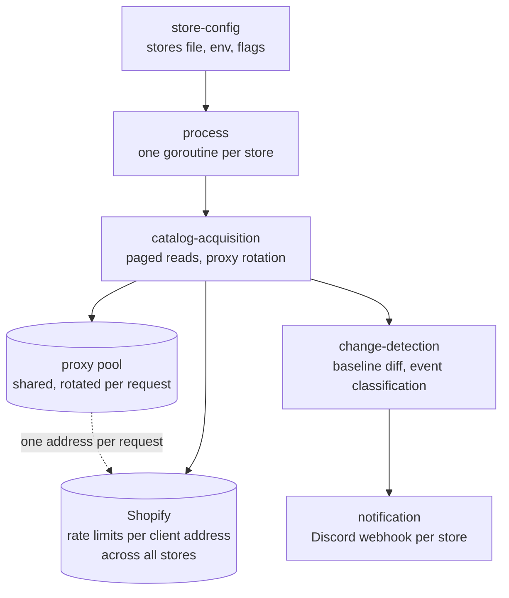

# High-Level Design: shopify-monitor

## Problem

Shopify storefronts publish their catalogue at `/products.json`. Stock changes
there are not announced: a sold-out variant becomes available again with no
event, no feed, and no notification. For products that sell out in seconds, the
gap between a restock happening and a person noticing it is the whole game.

Polling the endpoint is the only way to see the change, and polling it usefully
is harder than it looks. The endpoint pages at 30 products unless asked
otherwise, orders by publication date so a restock never surfaces near the top,
and is rate limited per client address across every Shopify store at once. A
naive poller watches a fraction of the catalogue, misses the events it exists to
catch, and gets itself banned from every store it watches simultaneously.

## Approach

A long-running process that holds a per-store baseline of variant availability,
re-reads each catalogue on an interval, and reports the differences.

Three disciplines make that work:

**Complete catalogue reads.** Every poll walks the entire catalogue rather than
its first page, because publication ordering means a restock can sit anywhere.

**A shared address budget.** Requests leave through a pool of proxies rotated
per request. The pool is global rather than per store, because the limit being
worked around is imposed on the client address across all of Shopify.

**Degradation over exit.** Stores fail independently and transiently. A failed
read is retried on the next cycle rather than retiring the store.

## Target Users

One operator running the monitor for themselves, on their own hardware, against
a handful of stores they care about. They supply the store list, the webhook
targets, and the proxies. They read the logs directly when something looks
wrong, and they are the same person who deploys it.

This shapes the design more than any other fact: there is no multi-tenancy, no
authentication, no UI, and configuration is files on disk rather than an API.

## Goals

- Detect a restock on any product in a monitored catalogue, not merely recent
  ones.
- Report a detected change to the store's configured Discord webhook.
- Survive transient failures — proxy timeouts, store rate limits, network
  blips — without operator intervention.
- Let the operator spend polling effort unevenly, so a store that restocks fast
  can be watched harder than one that does not.
- Run identically from a terminal, a container, or a service manager.

## Non-Goals

- **Purchasing, carting, or checkout.** This observes; it does not act.
- **Non-Shopify storefronts.** The catalogue shape, the paging rules, and the
  rate-limit behaviour are all Shopify-specific.
- **Historical storage.** State is the current baseline in memory. Restarting
  re-baselines and deliberately forgets.
- **Alert routing beyond a webhook per store.** No filtering rules, no
  subscriptions, no per-product targeting.
- **Multi-operator use.** Credentials sit in plain files; the trust boundary is
  the host.

## Tenets

- **A shared resource is spent globally, not per consumer.** When a limit is
  imposed on us as one client, budget it across every consumer rather than
  partitioning it per store.
- **Keep watching over reporting cleanly.** A monitor that stops is worse than
  one that logs and retries; degrade rather than exit.
- **Prefer the operator's file over a new flag.** Per-store behaviour belongs in
  the stores file beside the store it governs; global defaults belong in the
  environment.

## System Design

One goroutine per store, each looping independently over the same shared proxy
pool. Nothing is shared between stores except that pool and the process.

The four segments:

| Segment | Prefix | Owns |
| --- | --- | --- |
| `catalog-acquisition` | `ACQ` | Reading a complete catalogue without being rate limited: paging, ordering, request concurrency, proxy rotation. |
| `change-detection` | `DET` | The availability baseline and what counts as a reportable change. |
| `notification` | `NOTIFY` | Delivering a detected change to its destination. |
| `store-config` | `CFG` | The operator's inputs: the stores file, the proxies file, environment and flags. |

`catalog-acquisition` spans two Go packages (`internal/monitor` and
`internal/proxy`) because paging cadence and address rotation are one intent,
not two — see Key Design Decisions.

## Key Design Decisions

### The proxy pool is shared across stores, not partitioned per store

Measured against live stores: hammering one store until it returned `429` caused
two other, untouched Shopify stores to return `429` from the same address
immediately. Recovery took roughly seven minutes of no requests, and the penalty
compounded when requests continued during it.

The limit therefore attaches to the client address across Shopify as a whole.
Partitioning proxies per store — the intuitive design — would provide no
isolation, because a proxy spent on one store is spent on all of them. The
relevant budget is total requests per second across every store divided by pool
size.

*Alternative considered:* per-store proxy subsets, for blast-radius isolation.
Rejected because the measurements show the blast radius is already global; the
partition would reduce the effective pool size while isolating nothing.

### Every poll reads the whole catalogue

`/products.json` orders by publication date, descending, and that ordering is
fixed — the `order` parameter is accepted and ignored. A stock change does not
alter publication date, so a restocked product never moves toward the first
page. Reading only the first page bounds the monitor to recently published
products and silently misses restocks everywhere else.

*Alternative considered:* poll the first page frequently and the full catalogue
rarely, to cut bandwidth. Rejected for now because it makes restock latency
depend on where a product sits in the catalogue, which is the property this
project exists to remove. Revisit if bandwidth becomes the binding constraint;
the per-store interval is the cheaper lever.

### Polling interval is per store, not global

Stores differ in how much they are worth watching. A store that restocks in
seconds justifies bandwidth that a quiet one does not. The interval is therefore
an optional per-store value in the stores file, falling back to a global
default — placing the decision beside the store it governs.

### Configuration is environment and flags, with data files on disk

Settings come from environment variables and flags. Bulk operator data — stores,
proxies — lives in files, because it is lists rather than settings.

*Alternative considered:* loading a `.env` file inside the process. Rejected:
every runner already parses one (the task runner, Compose, systemd), so an
in-process loader would duplicate that and make the program's configuration
depend on the working directory it happened to start in.

### Failures are per store and non-terminal

A failed read retries on the next cycle. A store's goroutine ends only when the
process is shutting down.

*Alternative considered:* exiting on error and letting the supervisor restart.
Rejected because restarting discards every store's baseline, converting one
store's transient proxy timeout into a full re-baseline and a burst of spurious
first-cycle events.

## Success Metrics

- A restock of any variant in a monitored catalogue produces exactly one
  notification, within roughly one polling interval.
- No product in a monitored catalogue is structurally unobservable.
- Sustained operation across transient store and proxy failures without
  operator intervention.

Falsification signals — conditions under which this is judged broken:

- A restock occurs and no notification is produced.
- A change produces repeated notifications on successive cycles.
- The process exits on its own, or a store stops being polled while the process
  lives.
- Polling triggers rate limiting frequently enough to interrupt detection.

## References

- Shopify storefront catalogue endpoint: `/products.json`, with `limit`
  (maximum 250) and `page`. Behaviour relied on here is documented in
  `docs/intent/catalog-acquisition/catalog-acquisition-design.md`.
- Discord webhook execution and its per-webhook rate limiting, in
  `docs/intent/notification/notification-design.md`.
