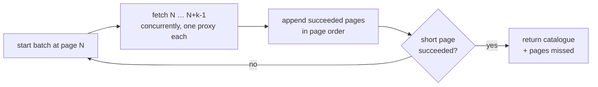

# Catalog Acquisition

## Context and Design Philosophy

This segment owns one question: how to read a store's complete catalogue,
repeatedly, without being cut off.

Paging and proxy rotation are one concern rather than two. The rate limit that
governs this system is imposed on the client address across all of Shopify, so
the number of pages a crawl fetches and the number of addresses available to
fetch them are the same budget viewed from two ends. Splitting them across
segments would leave the budget owned by neither.

The guiding constraint is that **the endpoint gives no negative
acknowledgement**. It never says "there are more products than you asked for"
or "you are reading a stale slice." A caller that asks the wrong question gets a
plausible-looking answer. Every rule below exists because some default produces
a confidently wrong result.

## The Catalogue Endpoint

`GET {store}/products.json`, unauthenticated, returning a JSON object with a
`products` array.

| Parameter | Behaviour |
| --- | --- |
| `limit` | Products per page. **Defaults to 30 when omitted; maximum 250.** |
| `page` | 1-based page number. |
| `order` | **Accepted and ignored.** |

Only the fields the diff needs are read: product `id`, `title`, `handle`, and
each variant's `id`, `title`, and `available`. The response carries
substantially more — description HTML, image metadata, pricing — which dominates
the payload but is not consumed.

### Ordering is by publication date, descending, and is not negotiable

Products are returned newest-published first. The ordering is stable and
continuous across page boundaries: the last item of a page is always older than
the first item of the next.

`order` is accepted and silently ignored — requesting `published_at asc`,
`updated_at desc`, or `id asc` all return the same descending publication order.
There is no way to ask the endpoint for the most recently *changed* products.

This is the single most consequential fact in this segment. **A stock change
does not alter publication date.** A product that restocks does not move toward
the first page. Reading only the first page therefore bounds the monitor to
recently published products and cannot observe a restock anywhere else in the
catalogue — while still producing a healthy-looking variant count that conceals
the gap.

### Termination

The endpoint reports no total count, so the end of the catalogue is discovered
rather than known. Two behaviours bound the walk:

- A page past the end returns HTTP 200 with an empty `products` array.
- An absurd page number returns HTTP 400.

A page shorter than the requested `limit` is therefore the last page, and a
crawl that keeps asking terminates on its own rather than looping forever.

**A short page is trusted as the end of the catalogue.** The endpoint offers no
way to distinguish a genuinely final page from a truncated one, and no
independent product count exists to check against, so no cross-check is
attempted.

### The endpoint stops at 25,000 products

Pagination is bounded by *offset*, not page count: `limit=250&page=101` is
refused with HTTP 400, while `limit=50&page=101` succeeds. Both reach the same
wall at 25,000 products, so the maximum page size is also the cheapest way to
reach it — a smaller page size only spends more requests arriving at the same
place.

Nothing beyond that offset is reachable through this endpoint. The store's
sitemaps do list the whole catalogue, but they carry no availability, and their
`lastmod` moves in bulk rather than per change, so they cannot stand in for it.
`since_id` is accepted and ignored; cursor pagination belongs to the
authenticated Admin API, not this one.

### Scale, and why depth is capped

Catalogues are far larger than the first page suggests, and their value is
concentrated at the front. Sampled across one monitored store:

| Page | Oldest product on it | Variants in stock |
| --- | --- | --- |
| 1 | 2 days old | 75% |
| 10 | 2 months | 29% |
| 25 | 3 months | 27% |
| 50 | 5 months | 0.5% |
| 100 | ~4 years | 0.4% |

That store holds roughly 35,800 products and 350,000 variants; 25,000 products
are reachable, of which the first quarter hold nearly all the live inventory.
Past roughly page 30 the catalogue is an archive — years old, effectively sold
out, and unlikely to change.

Reading to the reachable limit therefore spends most of its bandwidth watching
products that will not restock. Crawl depth is capped instead, in products
rather than pages, and set per store: a store whose whole catalogue fits in one
page needs no cap worth the name, while a large one is read only as deep as its
inventory is live.

Capping depth also shrinks the failure surface. A crawl's chance of hitting a
transient error grows with its request count, and a baseline crawl must be
complete — so a hundred-request crawl is markedly harder to complete cleanly
than a twenty-four-request one.

## Rate Limiting

Shopify rate limits the **client address**, not the store, and the limit spans
every Shopify-hosted storefront at once.

Measured against live stores:

| Observation | Measurement |
| --- | --- |
| Requests to trip `429` from a cold address | ~24 in rapid succession |
| Effect on other, untouched Shopify stores | Immediately `429` from the same address |
| Recovery with no successful requests | ~420 s |
| Second trip after recovery | On the first request |

Two consequences follow, and both are load-bearing.

**Proxies cannot be partitioned per store.** A proxy spent reading one store is
spent for every other store simultaneously. The pool is a single shared
resource, and the meaningful budget is total requests per second across all
stores divided by pool size — not per-store request rate.

**A rate-limited address must be rested, not retried.** The penalty compounds:
continuing to issue requests during a cooldown extends it, and the second trip
came far sooner than the first. Backoff has to be measured in minutes.

## Crawl Mechanics

A crawl walks pages in concurrent batches, each request drawing its own proxy,
stopping at the first short page.

**Why concurrent rather than sequential.** Three reasons, in order of weight:

1. *Address spread.* A sequential crawl through one client would issue a dozen
   requests in seconds from one address — the shape that trips `429`. Drawing a
   fresh proxy per page reduces it to one request per address.
2. *Snapshot coherence.* Because ordering is by publication date, a product
   published mid-crawl shifts every later product down one position. A product
   sitting near a boundary the crawl has already passed is displaced onto a page
   already read, and is missed for that cycle. Compressing a crawl from seconds
   to about a second narrows that window rather than closing it.
3. Wall-clock time.

**Why batches rather than full parallelism.** Where the crawl is uncapped the
page count is unknown before the walk begins, so the batch is a speculative
read-ahead, and overshooting the end costs a few empty responses of a few
hundred bytes each.

A capped crawl does not need to speculate. The cap is a product count and the
page size is fixed, so the pages required are known before the first request and
the walk asks for exactly those. A store capped below one page's worth issues a
single request rather than a batch of them.

**Page size is fixed for every request in a crawl.** A page number addresses an
offset of page size times page index, so varying the size mid-walk would skip or
repeat products. The cap is applied to the accumulated results afterwards, which
is also why it is expressed in products: it means the same thing regardless of
what the page size happens to be.

**Ordering is preserved.** Pages are appended in page order regardless of
completion order, so a crawl's output is identical to a sequential read's.

### Batch width is bounded by the pool

Rotation wraps around the pool, so a batch wider than the pool sends several of
its requests through the same address simultaneously — precisely the pattern
rotation exists to avoid. Effective batch width is therefore the smaller of the
configured width and the pool size.

With no proxies at all, every request already leaves from one address, so batch
width collapses to one: concurrency cannot spread what has nowhere to spread,
and a burst from a single address is the fastest way to a `429`.

### A crawl is bounded in time

Concurrency already bounds most of this: a batch takes as long as its slowest
page rather than the sum of its pages, so a crawl's worst case is the number of
batches times the per-request timeout — three batches for the largest catalogue
monitored, not twelve.

The per-request timeout is therefore the primary bound, and it is set tight: a
proxy that cannot deliver roughly a megabyte of JSON within it is not slow, it
is failing, and the crawl is better off recording the page as missed and moving
on.

A deadline over the whole crawl remains as a backstop, because batch count grows
with catalogue size and a large enough catalogue would otherwise multiply the
per-request bound without limit. Cancelling it cancels every request still in
flight.

Because a poll cycle is a crawl followed by a wait, this deadline also bounds
how long a store can go unpolled.

### A failed page is skipped, not fatal

A page that fails does not fail the crawl. The pages that succeeded are kept,
the failures are counted and reported, and the missing region is simply not
examined this cycle — it will be read on the next one.

This is safe because the availability baseline is only ever added to and
updated, never pruned: a product absent from a crawl is not observed to have
been deleted, it is just not looked at (see `change-detection`). Failing the
whole crawl would instead discard pages already paid for out of the rate-limit
budget, which under intermittent proxy failure can prevent any crawl from ever
completing.

**The baseline crawl is the exception.** The crawl that establishes a store's
initial baseline must be complete. Every variant absent from the baseline is
indistinguishable, on the next cycle, from a newly published one — so a single
missing page at startup yields thousands of spurious new-variant reports. A
baseline crawl that misses any page is retried in full rather than accepted.

## Proxy Rotation

The pool is a rotating list shared by every store, handed out one entry per
request.

Rotation returns a *client* rather than reassigning a shared field. A crawl
fetches its pages concurrently, so a mutable client on the monitor would be
written by several goroutines at once, and those goroutines each want a
different proxy in any case.

The rotation counter is mutated by every store's goroutine concurrently and is
mutex-guarded.

Proxies are optional. An empty or absent pool yields direct connections rather
than an error — correct for a first run, and viable for small catalogues, though
it forfeits the address spread a full crawl depends on. Running without proxies
is reported once at startup rather than per request, so the condition is visible
without a warning for every page of every crawl. A proxy that is present but
unusable is a different fault and is reported each time it occurs.

Entries are `host:port` or `host:port:user:pass`. Proxy URLs are always built
with an explicit scheme: a bare `host:port` parses without error into a URL
whose host is empty, producing a transport that silently dials nothing.

## Poll Cadence

A store's cycle is a crawl followed by a wait, in sequence. The interval between
crawls is therefore the crawl's duration plus the configured wait, not the wait
alone — a store set to five seconds whose crawl takes seven polls every twelve.

This is deliberate. Cycles never overlap, so a store whose proxies have gone
slow cannot accumulate concurrent crawls and multiply its own load against a
rate limit it is already struggling with. The configured value is the *rest*
between crawls rather than a target period.

## Failure Handling

Every request carries a timeout; a hung proxy would otherwise hold a crawl
goroutine, and the store's poll loop behind it, indefinitely.

A crawl that fails entirely is retried on the next cycle rather than ending the
store's watch, per the HLD's *keep watching over reporting cleanly* tenet.
Consecutive failures are counted and reported, and recovery is reported once.

## Decisions & Alternatives

| Decision | Chosen | Alternatives Considered | Rationale |
| --- | --- | --- | --- |
| Page size | `limit=250` | Endpoint default (30) | 30 is the default when omitted and caps the monitor at the newest 30 products; 250 is the maximum the endpoint accepts. |
| Catalogue coverage | Full walk every cycle | First page only; first page frequently plus full walk rarely | Publication ordering means a restock never surfaces near the top, so a partial read cannot observe most restocks. Tiered polling would make restock latency depend on catalogue position — the property this project exists to remove. |
| Termination | Stop on first short page, trusted | Fixed page cap; product-count cross-check | The endpoint reports no total. It serves an empty page past the end and 400s on an absurd one, so the walk is self-terminating and a cap would only add a failure mode. No independent count exists to cross-check a short page against. |
| Page fetching | Concurrent batches | Sequential | Sequential concentrates a dozen rapid requests on one address, and stretches the crawl long enough for publication-order drift to hide products. |
| Batch width | Smaller of configured width and pool size; one when no proxies | Configured width as given | Rotation wraps, so a batch wider than the pool puts several simultaneous requests on one address — the pattern rotation exists to prevent. |
| Crawl duration | Tight per-request timeout, with a whole-crawl deadline as backstop | A single generous crawl deadline; per-request timeouts alone | Concurrency means a crawl's worst case is batch count times the per-request timeout, so the per-request value does most of the bounding. The crawl deadline covers catalogues large enough for batch count itself to grow. |
| Failed page | Skip it, keep the rest, report the gap | Fail the whole crawl; retry the page in place | The baseline is never pruned, so an unread region is unexamined rather than misread as deleted. Failing the crawl discards pages already charged against the rate-limit budget. Retrying in place spends more budget at the moment the store is least willing to serve it. |
| Baseline crawl | Must be complete; retried in full | Same partial tolerance as later crawls | A variant missing from the baseline is reported as new on the next cycle, so one missing page at startup yields thousands of spurious reports. |
| Poll cadence | Crawl duration plus configured wait | Fixed period independent of crawl time | Non-overlapping cycles keep a store with slow proxies from multiplying its own load against a limit it is already hitting. |
| Proxy scope | One pool shared by all stores | A partition per store | Rate limiting attaches to the client address across all of Shopify, so a per-store partition isolates nothing while shrinking the effective pool. |
| Rotation granularity | Per request | Per poll cycle | Per cycle sends a whole crawl through a single address, which is the pattern that trips the limit. |
| Rotation interface | Return a client | Reassign a shared client field | Concurrent page fetches would race on a shared field, and each page wants a different proxy regardless. |
| Missing proxy file | Direct connections, reported once at startup | Fatal error; per-request reporting | A first run without proxies should work, and small catalogues do not need address spread. Reporting per request would emit a line for every page of every crawl, burying the condition it is meant to surface. |

## Open Questions & Future Decisions

### Deferred

1. **No `429`-specific handling.** A rate-limited response is treated as any
   other page failure. Given the measured compounding penalty, an address that
   returns `429` should be rested for minutes and skipped by the pool
   meanwhile; the pool has no concept of a cooling entry.
2. **Bandwidth is unbounded by design.** A full walk per cycle scales with
   catalogue size times poll frequency. Whether the payload can be narrowed at
   the source — the response is dominated by fields never read — is unverified.
3. **Publication-order drift is narrowed, not eliminated.** A product published
   during a crawl can still be missed for one cycle. It is caught on the next,
   so this costs latency rather than correctness, and no compensation is
   attempted.
4. **`updated_at` semantics are unknown.** Whether it moves on an inventory
   change was not determined; every sampled product carried an identical value
   from a bulk republish. It would not help ordering, since `order` is ignored,
   but it could cheapen diffing.
5. **Monitored stores are not staggered.** Every store issues its baseline
   crawl the moment monitoring begins, so startup produces a burst against the
   shared pool proportional to the number of stores. Harmless at the current
   store count and pool size; it scales the wrong way.
6. **Empty-page overshoot is unmeasured against the rate limit.** Speculative
   read-ahead issues requests past the end of the catalogue. They are cheap in
   bytes; whether they count toward the request budget is untested.

## References

- `docs/high-level-design.md` — the shared-pool decision and its measurements.
- `docs/intent/store-config/store-config-design.md` — per-store poll interval.
- `docs/intent/change-detection/change-detection-design.md` — the append-only
  baseline this segment's partial-crawl tolerance depends on.
